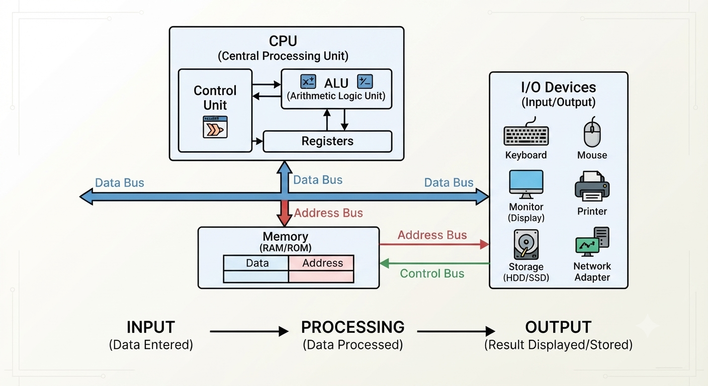

# Bilgisayar Bilimlerine Giriş

## 1. Bilgisayarların Temel Çalışma Mantığı
Bilgisayarlar temelde veriyi işleyen ve sonuç üreten makinelerdir. Bu süreç 4 adımda gerçekleşir:

1. **Girdi (Input):** Klavye, fare veya sensörler aracılığıyla ham verinin alınması.
2. **İşleme (Processing):** CPU (İşlemci) ve RAM (Hafıza) kullanarak verinin anlamlı hale getirilmesi.
3. **Çıktı (Output):** İşlenen verinin ekran, ses veya yazıcı gibi birimlerle kullanıcıya iletilmesi.
4. **Depolama (Storage):** Verinin uzun süreli saklanması.

### Neden 1 ve 0? (Binary Sistem)
Bilgisayarların dünyası elektriksel sinyallere dayanır:
* **0 (Kapalı/Düşük Voltaj):** Devreden akım geçmediğini temsil eder.
* **1 (Açık/Yüksek Voltaj):** Devreden akım geçtiğini temsil eder.
* **Ölçekleme:** Karmaşık sayılar, karakterler (ASCII) ve renk kodları, bu 1 ve 0 dizilerinin (bit) birleşimiyle ifade edilir.

## 2. Dijital Varlıklar
* **Görseller:** Dijital görüntüler, aslında renk kodlarına sahip binlerce minik noktadan (pixel) oluşan bir ızgaradır. Her piksel, RGB (Red, Green, Blue) değerlerini tutan sayısal verilerden oluşur.
* **Metin ve Ses:** Hepsi bilgisayar sisteminde önce sayısal değerlere dönüştürülür, ardından işlenir.

## 3. İnternet ve Web Çalışma Prensibi
Bir web sayfasına girmek şu süreci tetikler:

1. **Browser (İstemci):** İsteği başlatır.
2. **DNS:** İstenen sitenin IP adresini (server konumu) bulur.
3. **İnternet Servis Sağlayıcı (ISP):** İsteğin sunucuya iletilmesini sağlayan taşıyıcıdır.
4. **Server (Sunucu):** İsteği alır ve HTML, CSS, JS kodlarını browser'a geri gönderir.